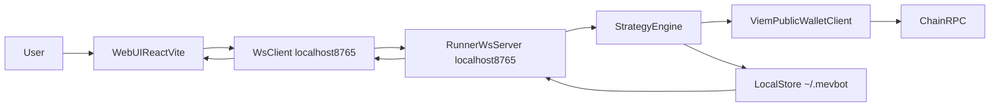

# MevBot

MevBot 是一个本地运行的 MEV 策略控制台，采用 **Web 前端 + Runner 执行引擎** 的双模块架构：

- `web/`：可视化控制台（策略开关、机会列表、PnL 展示、下载引导）
- `runner/`：本地执行与链上交互进程（WebSocket 服务、扫描、策略执行、数据持久化）

前端与执行引擎通过本机 `ws://localhost:8765` 通信。

## 功能概览

- 支持策略入口：`sandwich`、`arbitrage`、`sniper`
- 支持链配置：`BSC`、`ETH`、`Arbitrum`、`Base`（链枚举已内置）
- 支持本地 PnL 汇总与历史快照持久化
- 支持多平台 Runner 二进制发布（macOS / Windows / Linux）

## 当前能力边界（请先阅读）

- 当前仓库可完整跑通“本地 Runner + Web 控制台”的开发流程。
- 策略模块中仍有部分模拟/占位逻辑，适合作为研究与开发基座，不应默认视为可直接实盘盈利系统。
- 使用前请先在小额专用钱包测试，并自行评估交易与链上风险。

## 架构与数据流



## 目录结构

```text
MevBot/
├── runner/                 # 本地执行引擎（Node + TypeScript）
│   ├── src/
│   │   ├── index.ts        # Runner 入口，启动 WS 服务与策略调度
│   │   ├── core/           # scanner/mempool/ws/db 等核心能力
│   │   ├── config/         # 链与 DEX 配置
│   │   └── strategies/     # sandwich/arbitrage/sniper
│   ├── .env.example
│   └── package.json
├── web/                    # 控制台前端（React + Vite + Zustand）
│   ├── src/
│   └── package.json
└── .github/workflows/
    └── release.yml         # Runner 二进制发布流程
```

## 环境要求

- Node.js `18+`（建议使用 Node 18，与 CI 保持一致）
- npm `9+`
- 可访问目标链 RPC（建议自有高可用 RPC）

## 快速开始（开发模式）

### 1) 启动 Runner

```bash
cd runner
npm ci
cp .env.example .env
```

编辑 `runner/.env`（至少填好 `PRIVATE_KEY` 与 `RPC_URL`）后启动：

```bash
npm run dev
```

Runner 正常启动后会监听：`ws://localhost:8765`

### 2) 启动 Web

新开一个终端：

```bash
cd web
npm ci
npm run dev
```

按终端输出打开本地地址（通常是 `http://localhost:5173`）。

### 3) 最小可运行检查

- Web 下载/首页显示“Runner 已连接”
- Runner 终端出现 WebSocket 连接日志
- 在 Web 触发扫描后可收到 tokens/pnl 等消息

## 环境变量说明（`runner/.env`）

示例：

```env
CHAIN=BSC
RPC_URL=https://bsc-dataseed.binance.org
PRIVATE_KEY=0x_your_private_key_here
TELEGRAM_TOKEN=
TELEGRAM_CHAT_ID=
```

- `CHAIN`：目标链，默认 `BSC`
- `RPC_URL`：目标链 RPC 地址
- `PRIVATE_KEY`：执行钱包私钥（策略启动时必需）
- `TELEGRAM_TOKEN`：可选，Telegram Bot Token
- `TELEGRAM_CHAT_ID`：可选，Telegram 会话 ID

## 常用命令

### Runner（`runner/package.json`）

```bash
# 开发模式（监听）
npm run dev

# 直接启动 ts 入口
npm run start

# 构建 ts 输出 dist/
npm run build

# 运行构建产物
npm run start:prod

# 构建多平台二进制
npm run build:bin
npm run build:bin:mac-arm64
npm run build:bin:win
npm run build:bin:linux
```

### Web（`web/package.json`）

```bash
# 开发模式
npm run dev

# 构建
npm run build

# 预览构建结果
npm run preview
```

## 发布与二进制下载

项目通过 GitHub Actions 自动发布 Runner 二进制：

- 工作流：`.github/workflows/release.yml`
- 触发条件：推送 tag 且匹配 `v*`（如 `v0.1.0`）
- 发布产物：
  - `mevbot-runner-mac-arm64`
  - `mevbot-runner-mac-x64`
  - `mevbot-runner-linux-x64`
  - `mevbot-runner-win-x64.exe`

前端下载页默认使用：

- `https://github.com/qianyubtc/MevBot/releases/latest/download/<file>`

如果你 fork 了项目，请同步修改前端下载链接仓库地址。

## 本地数据与持久化

Runner 会在用户目录保存运行数据：

- `~/.mevbot/trades.json`：交易记录（最多保留 2000 条）
- `~/.mevbot/snapshots.json`：PnL 快照（最多保留 288 条，约 24h）

## FAQ / 故障排查

### 1) Web 显示 Runner 未连接

- 确认 Runner 已启动并监听 `ws://localhost:8765`
- 检查本机防火墙是否拦截本地端口
- 检查是否有其他进程占用了 `8765`

### 2) 点击启动策略后报“未配置私钥，无法启动策略”

- 确认 `runner/.env` 中 `PRIVATE_KEY` 已配置
- 私钥需 `0x` 前缀，且格式合法

### 3) 扫描/价格获取失败

- 优先检查 `RPC_URL` 是否可用、是否限流
- 使用更稳定或付费 RPC 节点

### 4) 下载的二进制无法执行

- macOS/Linux 先执行：`chmod +x <binary>`
- 确认下载文件与系统架构一致（arm64/x64）
- Windows 请使用 `.exe` 文件

## 安全与风险声明

- 私钥仅应保存在本地 `.env`，不要提交到仓库。
- 本仓库 `.gitignore` 已忽略 `runner/.env` 与 `*.env`，但请仍自行检查提交内容。
- 强烈建议使用专用小额钱包进行测试。
- 链上交易与 MEV 策略存在资金风险、滑点风险、失败风险与合规风险，需自行承担。

## License

本项目采用仓库中的 `LICENSE`。
